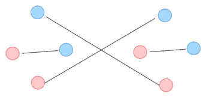

# Non-Coding Problems
## N1
First, note that the algorithm only picks the $k$ th classroom if the $1$ st until the $k - 1$ st classroom is unavailable. When the algorithm picks the $k$ th classroom, we know that the depth must be at least $k$ (i.e., $d \ge k$).

Suppose that $n > d$. Then that means that there is some point at which the first $n$ classrooms are occupied. In other words, $d \ge n$. However, this implies that $d > d$, which is a contradiction. Therefore, the assumption that $n > d$ is wrong, and so $d \ge n$ $\blacksquare$.

## N2

## N3a
$\frac{11}{28}$

The greedy algorithm outputs $\frac{1}{3} + \frac{1}{17} + \frac{1}{1428}$, but the correct answer is $\frac{1}{4} + \frac{1}{7}$